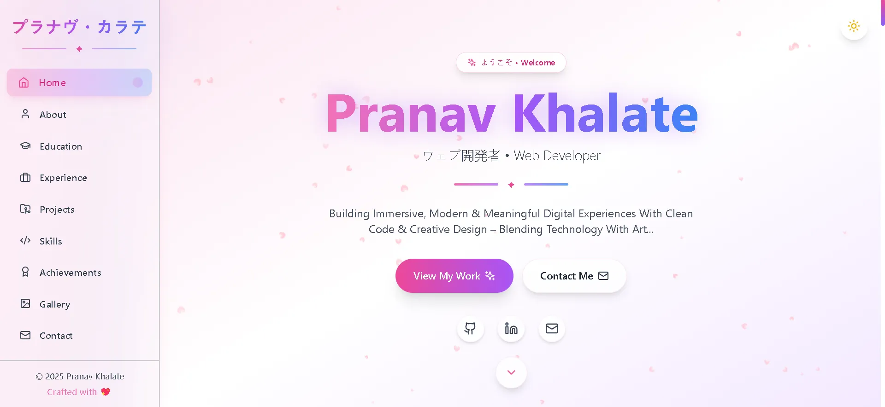
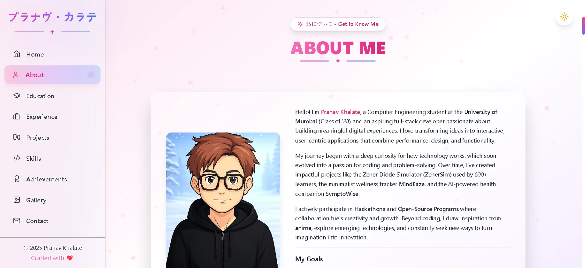
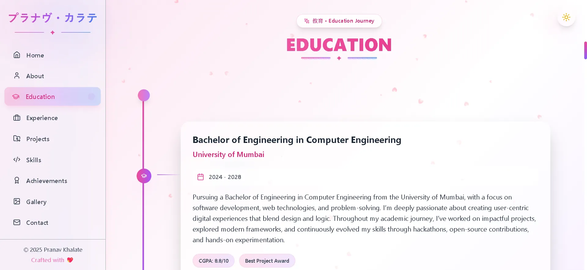
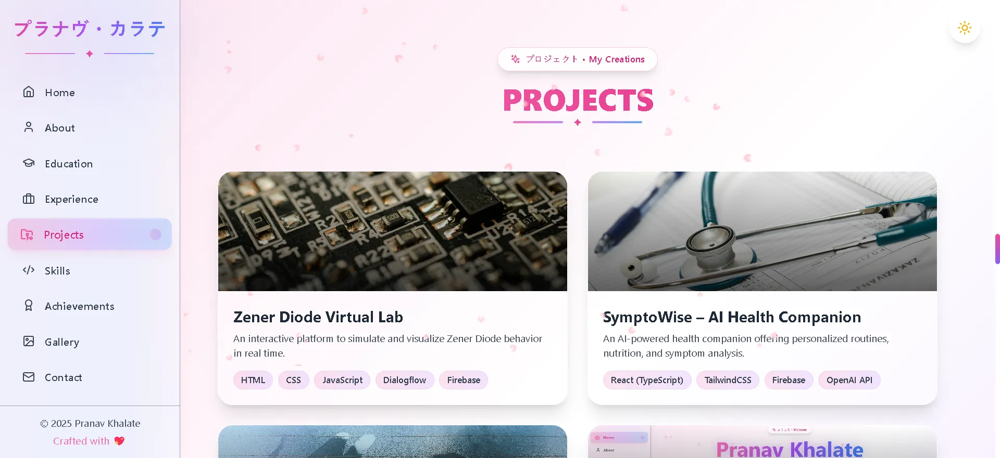
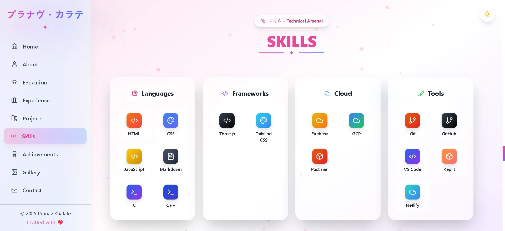
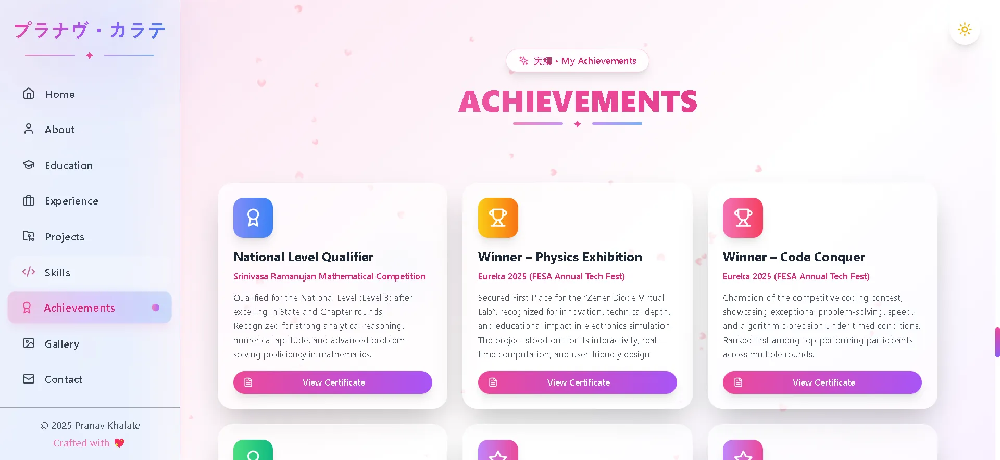
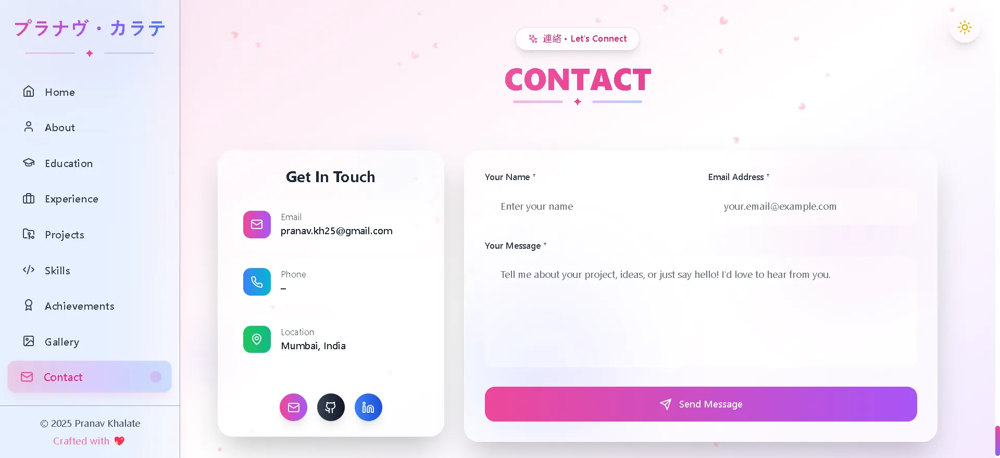

# 💫 Portfolio Website - Pranav Khalate

A fully responsive and dynamic **personal portfolio** built using **React (TypeScript)** and **Tailwind CSS**, designed to showcase my journey, projects, achievements, and skills as a Computer Science student and Web Developer.  

This portfolio serves as a digital reflection of who I am, combining **creative design**, **clean code**, and **modern web technologies** to build a professional identity on the web.  

From interactive sections and smooth animations to dark mode and accessibility, every element is crafted to ensure a seamless user experience.  

<br>

## 📚 Table of Contents

* [✨ Features](#-features)
* [🎨 Sections](#-sections)
* [📸 Preview](#-preview)
* [📁 Project Structure](#-project-structure)
* [⚙️ Technologies Used](#-technologiesused)
* [🚀 Getting Started](#-getting-started)
* [🎯 Customization Guide](#-customization-guide)
* [📱 Performance & SEO](#-performance--seo)
* [🛠️ Build & Deployment](#-build--deployment)
* [🤝 Contributing](#-contributing)
* [📄 License](#-license)
* [🌟 Show Your Support](#-show-your-support)
* [📞 Connect With Me](#-connect-with-me)

<br>

## ✨ Features

- **Immersive Particle Background** with interactive animations <br>
-    **Smooth Scroll Navigation** with active section highlighting <br>
- **Dark/Light Mode Toggle** with system preference detection <br>
- **Responsive Design** optimized for all devices <br>
- **TypeScript** for type-safe development <br>
- **Framer Motion** for smooth animations and transitions <br>
- **Lucide React Icons** for consistent iconography <br>
- **Component-Based Architecture** for maintainable code <br>
- **Performance Optimized** with lazy loading <br>
- **SEO Friendly** structure and meta tags <br>

<br>

## 🎨 Sections

| Section | Description |
|---------|-------------|
| **🎯 Hero** | Compelling introduction with CTA and animated elements |
| **👨‍💻 About** | Personal story, background, and professional philosophy |
| **🛠️ Skills** | Technical skills with visual proficiency indicators |
| **💼 Experience** | Professional journey with timeline visualization |
| **🎓 Education** | Academic background and certifications |
| **🚀 Projects** | Featured projects with interactive modals and demos |
| **🏆 Achievements** | Awards, recognitions, and accomplishments |
| **📸 Gallery** | Visual portfolio and creative works |
| **💬 Testimonials** | Client and colleague endorsements |
| **📞 Contact** | Contact form and social media links |

<br>

## 📸 Preview

| **Hero Section**                                   | **About Section**                                    |
| ------------------------------------------------ | ------------------------------------------------ |
|       |        |

| **Education Section**                         | **Experience Section**                         |
| ------------------------------------------------ | ------------------------------------------------ |
|  |  |

| **Project Section**                      | **Skills Section**                          |
| ------------------------------------------------ | ------------------------------------------------ |
|         |   |
    
| **Achievements Section**  | **Contact Section**                         |
| ------------------------------------------------ | ------------------------------------------------ |
|         |        |
    
<br>

## 📁 Project Structure

```bash
📁 Portfolio_/
├── 📁 public/
│   └── 📁 assets/
│       ├── 📁 images/                  # Profile Pic           
│       │
│       └── 📁 preview/                 # Portfolio Images        
│
├── 📁 src/
│   ├── 📁 components/
│   │   ├── 📁 sections/                 # All Portfolio Sections
│   │   │   ├── About.tsx                # About Me Section
│   │   │   ├── Achievements.tsx         # Awards & Recognition
│   │   │   ├── Contact.tsx              # Contact Form & Info
│   │   │   ├── Education.tsx            # Education Background
│   │   │   ├── Experience.tsx           # Work Experience
│   │   │   ├── Gallery.tsx              # Visual Portfolio
│   │   │   ├── Hero.tsx                 # Landing Section
│   │   │   ├── Projects.tsx             # Project Showcase
│   │   │   ├── Skills.tsx               # Technical Skills
│   │   │   └── Testimonials.tsx         # Client Testimonials
│   │   │
│   │   ├── Header.tsx                   # Navigation Header
│   │   ├── ParticleBackground.tsx       # Animated Background
│   │   └── Sidebar.tsx                  # Mobile Navigation
│   │
│   ├── 📁 lib/
│   │   └── ga.ts                        # Google Analytics
│   │
│   ├── App.tsx                          # Main App Component
│   ├── index.css                        # Global Styles
│   ├── main.tsx                         # App Entry Point
│   └── vite-env.d.ts                    # TypeScript Declarations
│
├── .gitattributes
├── .gitignore
├── eslint.config.js                     # ESLint Configuration
├── index.html                           # HTML Template
├── LICENSE                              # MIT License
├── README.md                            # Project Documentation
├── package-lock.json
├── package.json                         # Dependencies
├── postcss.config.js                    # PostCSS Config
├── tailwind.config.js                   # Tailwind Configuration
├── tsconfig.app.json                    # TypeScript App Config
├── tsconfig.json                        # TypeScript Config
├── tsconfig.node.json                   # TypeScript Node Config
└── vite.config.ts                       # Vite Build Configuration
```

<br>

## ⚙️ Technologies Used

| Technology | Purpose | Version |
|------------|---------|---------|
| **React** | Component-based UI library | ^18.2.0 |
| **TypeScript** | Type-safe JavaScript | ^5.2.0 |
| **TailwindCSS** | Utility-first CSS framework | ^3.3.0 |
| **Vite** | Fast build tool and dev server | ^4.4.0 |
| **Framer Motion** | Animation library | ^10.16.0 |
| **Lucide React** | Beautiful icons | ^0.288.0 |
| **ESLint** | Code linting and quality | ^8.52.0 |
| **PostCSS** | CSS processing | ^8.4.0 |

<br>

## 🚀 Getting Started

### Prerequisites
- Node.js (version 16 or higher)
- npm or yarn package manager <br><br>

### Installation

1. **Clone the repository**
```bash
git clone https://github.com/FrostByte-49/portfolio.git
cd portfolio
```

2. **Install dependencies**
```bash
npm install
```

3. **Start development server**
```bash
npm run dev
```

4. **Open your browser**
Navigate to `http://localhost:5173` to view the portfolio. <br><br>

### Build for Production

```bash
# Create production build
npm run build

# Preview production build
npm run preview
```

<br>

## 🎯 Customization Guide

### Personal Information
Update the following files with your personal information:
- `src/components/sections/Hero.tsx` - Name, title, and introduction
- `src/components/sections/About.tsx` - Personal story and background
- `src/components/sections/Contact.tsx` - Contact information and social links <br><br>

### Projects Showcase
Edit `src/components/sections/Projects.tsx` to add your projects:
```tsx
const projectsData = [
  {
    title: 'Your Project Name',
    description: 'Project description',
    image: '/path/to/image',
    technologies: ['React', 'TypeScript', 'Tailwind'],
    githubUrl: 'https://github.com/your-repo',
    liveUrl: 'https://your-project.com'
  }
];
```
<br>

### Styling & Themes
Modify colors and themes in:
- `tailwind.config.js` - Brand colors and design system
- `src/index.css` - Global styles and CSS variables <br><br>

### Images
Replace placeholder images in `public/assets/images/` with your own:
- `Me_.webp` - Your professional photo
- Add project screenshots and gallery images

<br>

## 📱 Performance & SEO

### Optimizations Included
- **Lazy Loading**: Components load as needed
- **Image Optimization**: WebP format for faster loading
- **Code Splitting**: Efficient bundle splitting
- **SEO Meta Tags**: Proper title and description tags
- **Accessibility**: ARIA labels and keyboard navigation <br><br>

### Performance Metrics
- Lighthouse Score: 95+
- First Contentful Paint: <1.5s
- Cumulative Layout Shift: <0.1

<br>

## 🛠️ Build & Deployment

### Deployment Options

**Netlify**
```bash
# Build command
npm run build

# Publish directory
dist
```

**Vercel**
```bash
# Automatic deployment from Git
# Vercel detects Vite and configures automatically
```

**GitHub Pages**
```bash
npm install --save-dev gh-pages

# Add to package.json
"homepage": "https://yourusername.github.io/portfolio",
"scripts": {
  "predeploy": "npm run build",
  "deploy": "gh-pages -d dist"
}
```
<br>

### Environment Variables
Create `.env` file for sensitive data:
```env
VITE_CONTACT_EMAIL=your-email@domain.com
VITE_GITHUB_URL=your-github-profile
VITE_LINKEDIN_URL=your-linkedin-profile
```

<br>

## 🤝 Contributing

Contributions are welcome! If you have suggestions for improvements or find any issues:

1. **Fork the repository**
2. **Create a feature branch**
```bash
git checkout -b feature/amazing-improvement
```
3. **Commit your changes**
```bash
git commit -m 'Add some amazing improvement'
```
4. **Push to the branch**
```bash
git push origin feature/amazing-improvement
```
5. **Open a Pull Request** <br><br>

### Development Guidelines
- Follow TypeScript best practices
- Use meaningful component and variable names
- Maintain consistent code formatting
- Add comments for complex logic
- Test responsive design on multiple devices

<br>

## 📄 License

This Project is licensed under the [MIT License](https://opensource.org/licenses/MIT). Feel free to explore and build upon it. <br>
**© 2025 Pranav Khalate**  

```text
Permission Is Hereby Granted, Free Of Charge, To Any Person Obtaining A Copy...
```
<br>

## 🌟 Show Your Support

If this portfolio template helped you or inspired your own project:

- ⭐ **Star the repository** to show your appreciation
- 🐛 **Report issues** to help improve the template
- 🔄 **Fork and customize** for your own use
- 📢 **Share with others** in the developer community

<br>

## 📞 Connect With Me

[](https://github.com/FrostByte-49)
[](https://www.linkedin.com/in/pranav-kh/)
[](mailto:pranav.kh49@gmail.com)
[](https://pranavkhalate.netlify.app)

